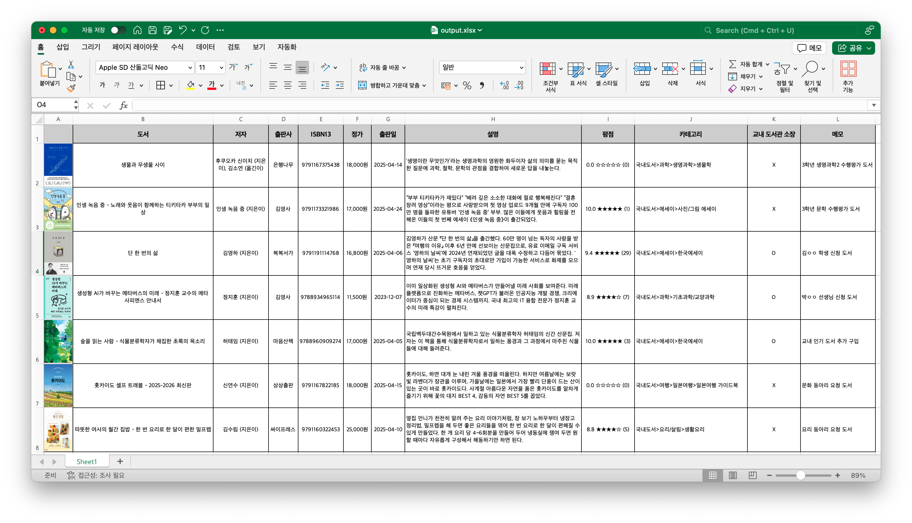
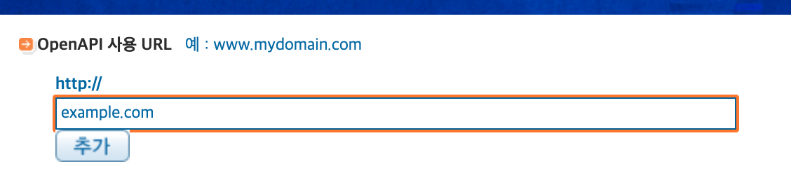
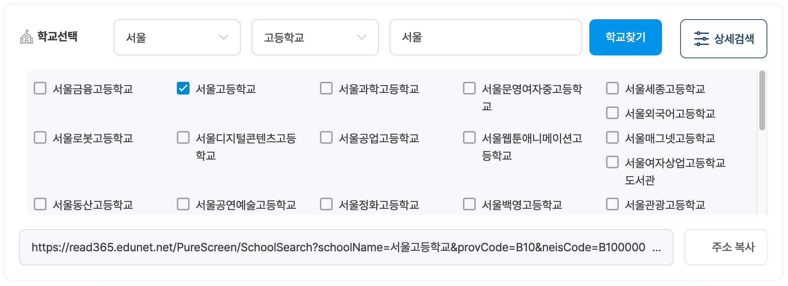

# 🫠 BookListBuilder

책 정보를 일일이 찾아보고 교내 도서관에 이미 있는 책인지 매번 확인하고 엑셀에 하나 하나 정리하는 작업 매우 번거롭지 않나요? `BookLinkBuilder`를 활용하여 각종 책의 정보과 교내 도서관 소장 여부를 보기 쉽게 엑셀 파일로 정리해보세요.

도서 구입 여부에 도움을 줄 수 있는 `책 설명`, `책 평점(알라딘)` 등의 정보도 정리해준답니다.

- 정리해주는 정보: `책 표지 이미지`, `도서 제목`, `저자`, `출판사`, `ISBN`, `판매가 (정가)`, `출판일`, `도서 설명`, `도서 평점 (알라딘)`, `도서 카테고리`, `교내 도서관 소장 여부`




## ⚙️ 설정 파일 세팅하기

프로그램 실행 전, 프로젝트 폴더 내 `config.yml` 파일을 아래와 같이 작성하세요.

```yaml
aladinKey: "알라딘 TTB 키"
libraryLink: "https://read365.edunet.net/PureScreen/SchoolSearch?schoolName=...&provCode=...&neisCode=..." # 학교 도서관 독서로 홈페이지 주소를 입력합니다.
outputFileName: "output.xlsx" # 결과를 저장할 파일의 이름을 확장자를 포함하여 지정합니다.
```

### 🧞 알라딘 API Key 발급 방법

1. [알라딘 OpenAPI 페이지](https://www.aladin.co.kr/ttb/wblog_manage.aspx)에서 접속합니다.

2. `OpenAPI 사용 URL`에 주소를 추가합니다. (아무 주소를 입력해도 상관 없습니다.)
* `example.com`와 같이 입력해도 정상 작동 합니다.


3. `등록된 URL 목록`에서 `Open API 인증키`를 복사합니다
* `ttb`로 시작하는 코드입니다.

### 🏫 독서로 홈페이지 주소 확인 방법



1. [독서로 - 우리학교 도서 검색](https://read365.edunet.net/SchoolSearch) 사이트에 접속합니다.
2. 학교를 선택하고 `주소 복사` 버튼을 클릭합니다.


## 📚 책 리스트 관리하기

리스트를 생성할 책들의 `ISBN`을 알아야 진행하실 수 있습니다.
이 프로그램에서 사용하는 ISBN은 흔히 `ISBN13`이라 불리는 `13글자` 길이의 ISBN 입니다.

- `list.xlsx` 파일을 열어 `A`열에 `ISBN13`, `B`열에 메모를 입력합니다.
- 메모 칸은 비워둘 수 있습니다.


아래 예시와 같이 `list.xlsx`를 작성하실 수 있습니다.

| ISBN13 | 메모 (선택) |
|-|-|
| 9791191114768 | 김ㅇㅇ 학생이 신청한 도서 |
| 9791173321986 | 3학년 국어 수행평가 도서 |

## 🧑🏻‍💻 프로그램 실행하기

1. `Python 3.9+` 환경이 필요합니다.
2. 위 내용에 따라 `설정 파일(config.yml)`과 `리스트 파일(list.xlsx)`을 준비해주세요.
3. 아래 명령어를 실행하여 필요한 라이브러리를 설치해주세요.
```bash
pip install -r requirements.txt
```
4. 아래 명령어를 실행하여 스크립트를 실행하세요.
```bash
python script.py
```
